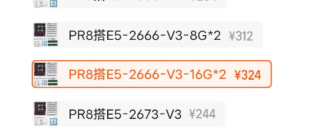

# 主板 + CPU + 内存

因为要多开,所以直接选择E5系列CPU

---

**注意, 由于目前市面上E5系列cpu均为二手, 可能出现小毛病.**

**但是由于CPU本身很难坏, 所以只是提醒一下, 最好有心理预期, 鉴于这个价格, 出点小毛病也是可以接受的**

---

### 综合考虑选择了 E5-2666V3 + 巨械师X99 PR8 + 16G * 2内存条

CPU: 性价比很高, 10核心20线程, 支持DDR3内存

主板: 巨械师好歹算个牌子, 带三年质保, 比那些啥都没有的杂牌能强点, 然后这个套装带两根16G内存, 直接省的再买内存了

主板cpu内存这三个分开买和他家这个一起买的一个价, 所以为了省事直接一起买

`点进链接之后直接选PR8搭E5-2666-V3-16G*2就行`

